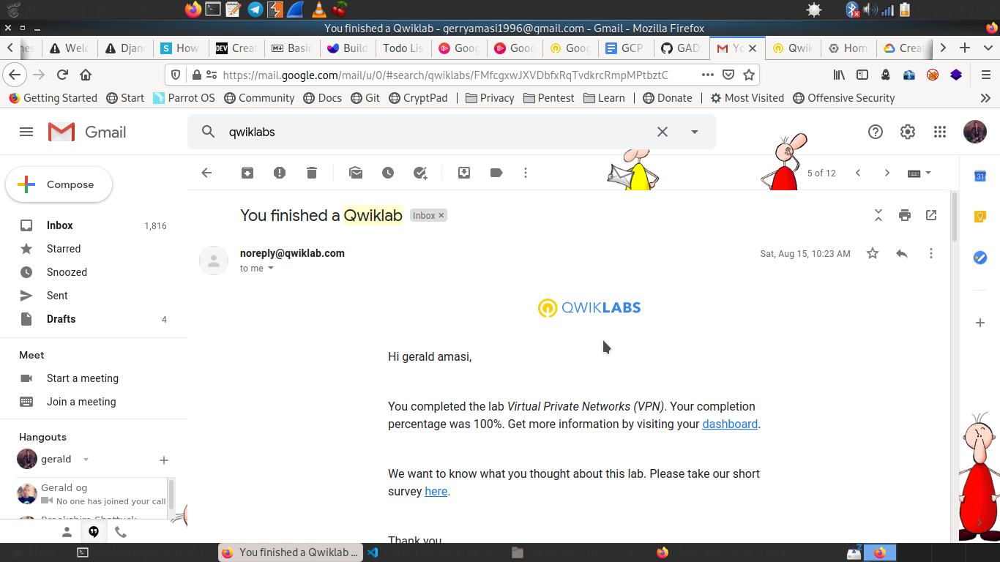

# VPC Networking 

## Objctives 

 - Explore the default VPC network
 - Create an auto mode network with firewall rules
 - Convert an auto mode network to a custom mode network
 - Create custom mode VPC networks with firewall rules
 - Create VM instances using Compute Engine
 - Explore the connectivity for VM instances across VPC networks

## Steps

1. Explore default VPC Network

    - View Subnets

        gcloud compute networks subnets list

    - View the routes

        gcloud compute routes list

    - View the firewall rules

        gcloud compute firewall-rules list

    - Delete Firewall rules 

        gcloud compute firewall-rules delete  default-allow-*

2. Create an auto mode network

    - Creating the network in auto mode

        gcloud compute networks create mynetwork --project=primal-outrider-269208 --subnet-mode=auto --bgp-routing-mode=regional

    - Create the firewall rule for the network

        gcloud compute firewall-rules create mynetwork-allow-icmp  --network=mynetwork - --direction=INGRESS --priority=65534 --source-ranges=0.0.0.0/0 --action=ALLOW --rules=icmp

        gcloud compute firewall-rules create mynetwork-allow-all  --network=mynetwork - --direction=INGRESS --priority=65534 --source-ranges=0.0.0.0/0 --action=ALLOW --rules=all

        gcloud compute firewall-rules create mynetwork-allow-ssh  --network=mynetwork - --direction=INGRESS --priority=65534 --source-ranges=0.0.0.0/0 --action=ALLOW --rules=tcp:22

    - Creating The VM in us-central1-c

        gcloud compute instances create mynet-us-vm --machine-type 'n1-standard-1' --image-project 'debian-cloud' --image 'debian-9-stretch-v20200910' --subnet 'default' --zone=us-central1-c

