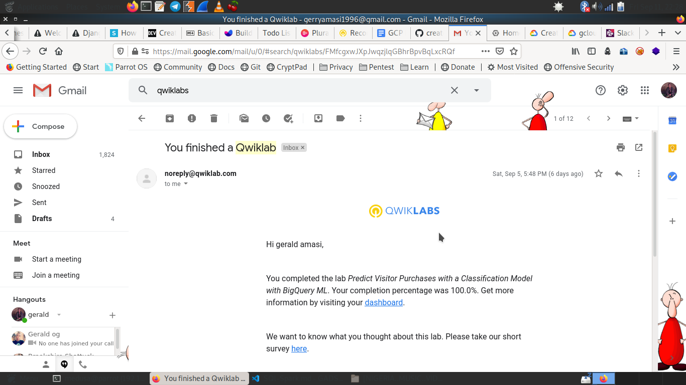

# Predicting Visitor Purchases with a Classification Model with BigQuery ML 

## Objectives

 - Use BigQuery to find public datasets
 - Query and explore the ecommerce dataset
 - Create a training and evaluation dataset to be used for batch prediction
 - Create a classification (logistic regression) model in BigQuery ML
 - Evaluate the performance of your machine learning model
 - Predict and rank the probability that a visitor will make a purchase

## Steps 

1. Explore ecommerce data

    

